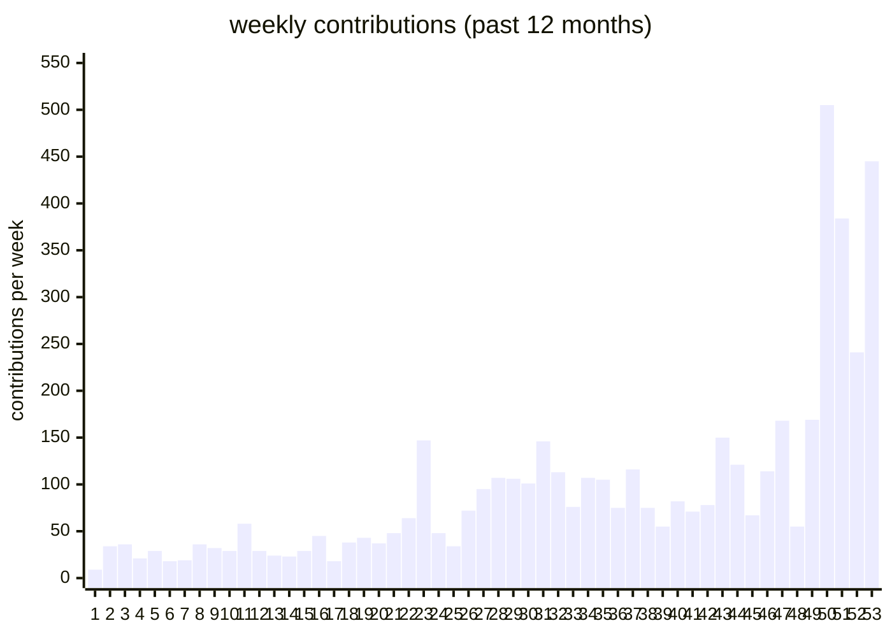
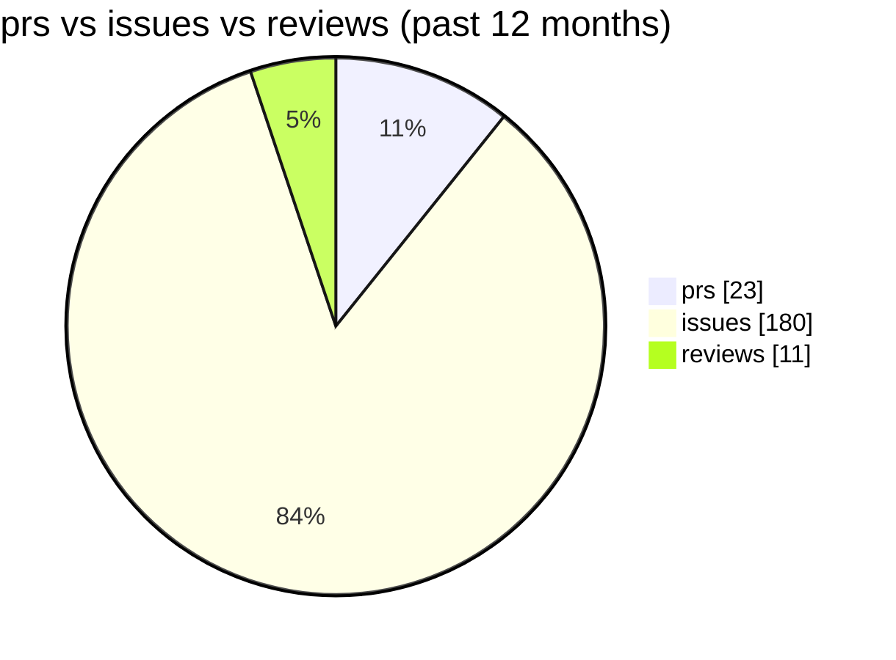

# hi, i'm siddhant singh

building products at the intersection of ai, growth, and execution.

## main-gig

-  [engram](https://engramhq.com) - building ai-native systems and workflows.

## prev-main gig

-  [vinci](https://tryvinci.com) - built ai agents for brands and creative teams.

## open-source projects

-  [sheety-crm](https://github.com/sdntsng/sheety-crm) - a stateless, open-source crm on google sheets.
-  [momontum](https://github.com/sdntsng/momontum) - python project for agentic trading and backtesting.
-  [gh-audit](https://github.com/sdntsng/gh-audit) - python toolkit for github repo and activity audits.
-  [distrosid](https://github.com/sdntsng/distrosid) - ai-native music distribution workflows.
-  [open-mool/open-mool](https://github.com/open-mool/open-mool) - public infra for preserving cultural heritage.
-  [tryvinci/vinci-clips](https://github.com/tryvinci/vinci-clips) - open-source ai video clipping platform for short-form content.
-  [artimech/artimech-website](https://github.com/artimech/artimech-website) - artimech ai/ml engineering studio website.
-  [tryvinci/docs](https://github.com/tryvinci/docs) - documentation site for vinci tools.

## other repos

-  [rhea](https://github.com/sdntsng/rhea) - python experiments for workflow automation.
-  [scriptkiddy](https://github.com/sdntsng/scriptkiddy) - scripts for google sheets, docs, and similar tools.
-  [lipi](https://github.com/sdntsng/lipi) - a handwritten assignment scribe.
-  [scrollnet-mvp](https://github.com/sdntsng/scrollnet-mvp) - gamified video feedback mvp.
-  [crawlmighty](https://github.com/sdntsng/crawlmighty) - agentic spin-off of [crawl4ai](https://github.com/unclecode/crawl4ai).
-  [clapp](https://github.com/sdntsng/clapp).
-  [vacayy](https://github.com/sdntsng/vacayy).
-  [vinci-commerce](https://github.com/sdntsng/vinci-commerce) - archived.
-  [rnbirthdaycrossword](https://github.com/sdntsng/rnbirthdaycrossword) - a sf treasure hunt for my fiance's birthday.

## commit activity

daily contributions (past 12 months):

weekly contributions (past 12 months):

prs / issues / reviews (past 12 months):

## latest writing

- [the year of just doing things](https://siddhant.site/blog/reflecting-on-2025)
- [to diffuse like a human](https://siddhant.site/blog/to-diffuse-like-a-human)
- [about valleys](https://siddhant.site/blog/about-valleys)
- [misfit is okay, median is not okay](https://siddhant.site/blog/misfit-is-okay-median-is-not-okay)
